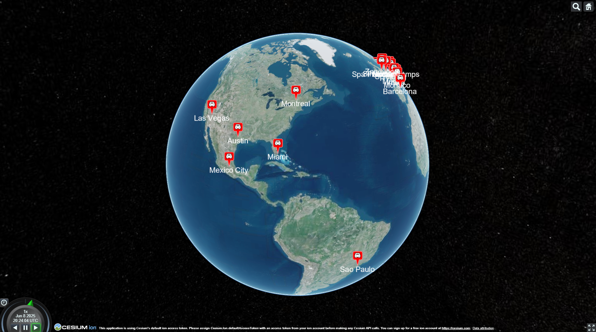
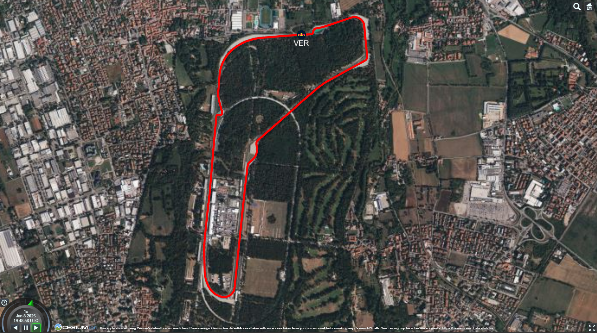
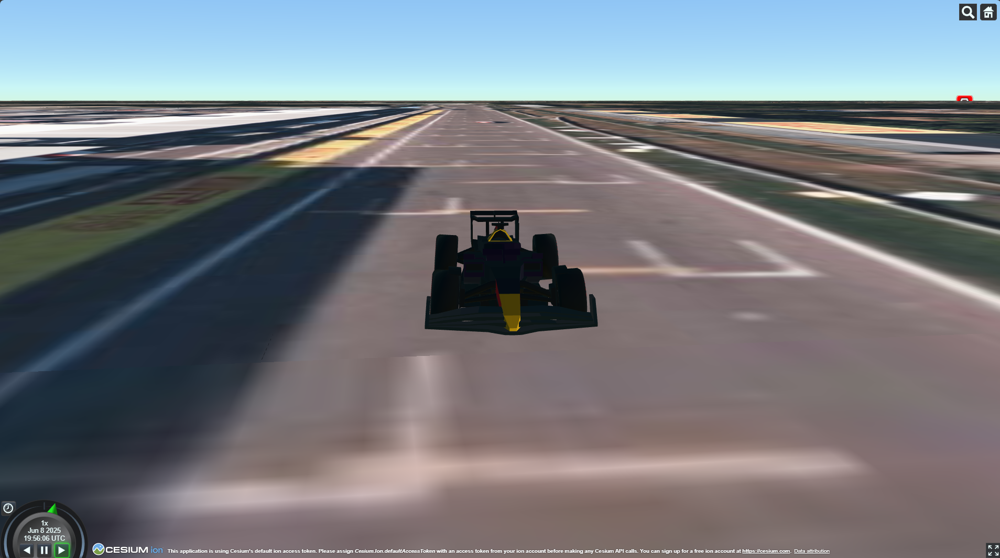

# 🏎️ F1 Race Replay 🏎️


A full-stack application for visualising and replaying Formula 1 race telemetry data. It features a real-time 3D race viewer built with React, Cesium and Resium, allowing users to spectate races from any angle. The Dockerised backend Python service ingests F1 session data using the FastF1 library, before serialising it using Protobuf and 
streaming it using Kafka.

## Utilised Technologies


## Screenshots




## Project Setup

### Prerequisites
- VS Code
- [VS Code Dev Containers Extension](https://marketplace.visualstudio.com/items?itemName=ms-vscode-remote.remote-containers)

### Steps

1. Within VSCode, open the command pallette then run "Dev Containers: Reopen in Container"

2. Lint, test, and build each project:
   ```sh
   nx run-many -t lint test e2e build container
   ```
3. Run the F1 Race Replay stack:
   ```sh
   docker compose up -d
   ```
4. Access the F1 Race Viewer from: http://localhost:80

## Disclaimer

This repository is not associated in any way with the Formula 1 companies. F1, FORMULA ONE, FORMULA 1, FIA FORMULA ONE WORLD CHAMPIONSHIP, GRAND PRIX and related marks are trade marks of Formula One Licensing B.V.
